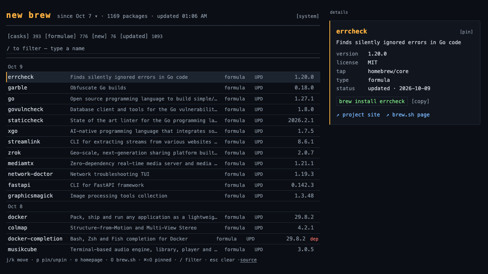

# New Brew

A static site for catching up on new and updated Homebrew packages — what you
see scroll by in the `brew update` preamble, presented as a scannable,
console-styled timeline. It tracks both formulae and casks over a 60-day
window, remembers what you've already seen, and links out to each project's
homepage and brew.sh page.



## Usage

Scan the timeline, expand a row to read what the package does, and click out
to the project site if interested.

## Development

```sh
npm install
npm run sync:data   # pull changes.json from gh-pages (needs a remote)
npm run dev
```

Production build (the static site, also used by the deploy workflow):

```sh
npm run build
```

`npm run dev` (or `npm run preview`, an alias) serves the app with live
reload while editing. To eyeball the real built output, run `npm run build`
and serve `build/` with any static file server.

Unit tests:

```sh
npm test
```

## Data

`changes.json` is generated by a scheduled GitHub Action
(`.github/workflows/data.yml`, 3× per day during US work hours) and
committed to the `gh-pages` branch — it's untracked on `main`, so bot data
updates never touch source history. Pages serves the `gh-pages` branch
directly, so a fresh `changes.json` goes live as soon as the Pages branch
build finishes.

For local development, pull the latest data (needs a published remote):

```sh
npm run sync:data
```

## Deployment

GitHub Pages serves the `gh-pages` branch (set Pages → Source to "Deploy
from a branch: `gh-pages`" once in repo settings).
`.github/workflows/deploy.yml` builds the site on every push to `main` and
publishes `build/` to `gh-pages`, carrying over the latest `changes.json`
committed by the data job.
